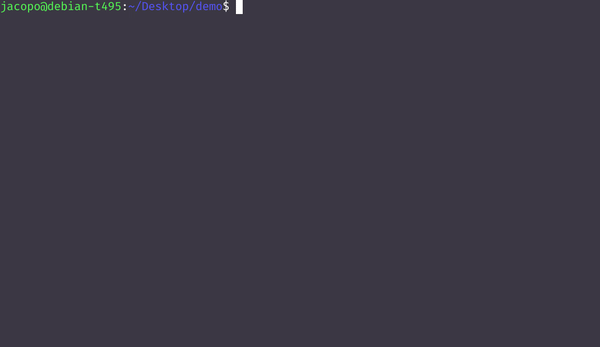

# XMLJSONConverter
This tool allows a seamless conversion from XML/JSON to JSON/XML without the need of XSD (XML Schema). 
- conversion from XML to JSON is always doable
- conversion from JSON to XML is doable, but JSON file must be organized in a defined structured way (readable by the tool, see below)

<p align="center"></p>

## Usage
To convert specify the input file (`.xml`, `.railml`, `.json`) and then specify the output file.

Example:
```bash
java -jar XMLJSONConverter input-file.xml output-file.json
```

## Supported json format
While every well-formed XML file in input is supported, that's not the case for JSON, because JSON data structure is not as rigid as XML, so to convert from JSON to XML is necessary to follow the following format for JSON data:
```json
{
    "root": "root_value",
    "namespaces": [
      {"prefix_1": "URI"},
      ...
    ],
    "attributes": [
      {"attribute_1": "attribute_value"},
      ...
    ],
    "elements": [
      {
        "child_element_1": "child_value"
      },
      ...
    ]
}
```

You can see that the JSON document is divided recursively in 4 sections:
  - `"element_name": "value"` This part define an element and its value (if it has no value, put `null` as value). The element with his value will be converted in XML as it is. [**This  is the only mandatory section, the other 3 sections are optional**]
  - `"namespaces":[...]`. This part will define a list of namespaces for the element in this scope. Every namespace is represented here as an object (i.e. in curly braces).
    - as said, every element in this list is an object that represent a namespace, with `"prefix":"URI"`. If you want to define the XML _default namespace_ (ie `xmlns`), you must set `"":"URI"`, so that `prefix` is an empty string. [**This section is optional**]
  - `"attributes":[...]`. This part will define a list of attributes for the element in this scope. Every attribute here is represented as an object (i.e. in curly braces). [**This section is optional**]
  - `"elements":[...]`. This part is the recursive part. Here will be defined the children elements of the actual element, in the way the previous section already described.[**This section is optional**]


## Limitations
- mixed content is not supported:
  - XML elements cannot be mixed (`mixed=true` schemas not supported)
  - JSON (due to XML conversion) cannot have more than one plain `"property":value` field per object. But it can contain other elements as a list with other single field `"property":value`
- every json value is treated and forced to be a String, that because XML treats every value as a text-element and the tool is not informed about the XML schema. 
  - So when converting from XML to JSON, every JSON value will be converted as a String
  - JSON values in input are not required to be String in Json `element_name` value (non String value for value in `namespaces` and `attributes` are not valid)

